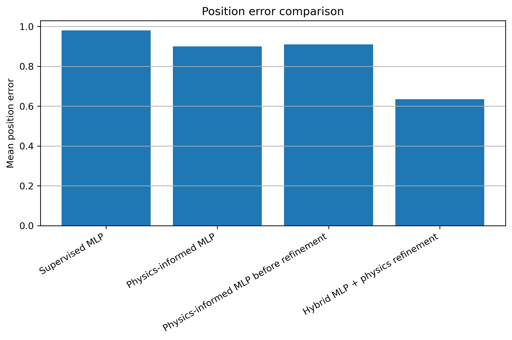
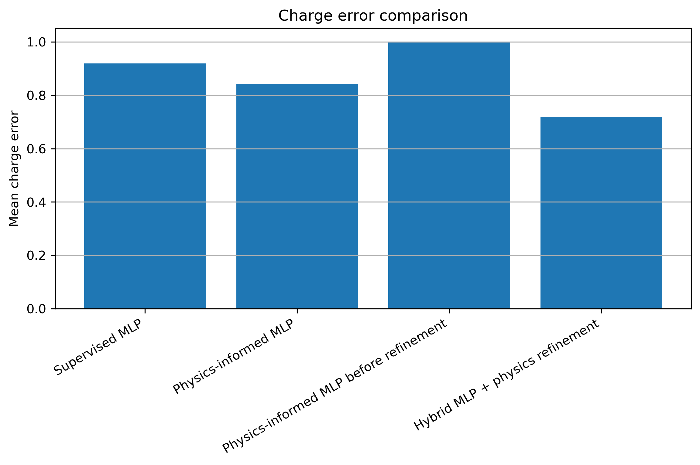
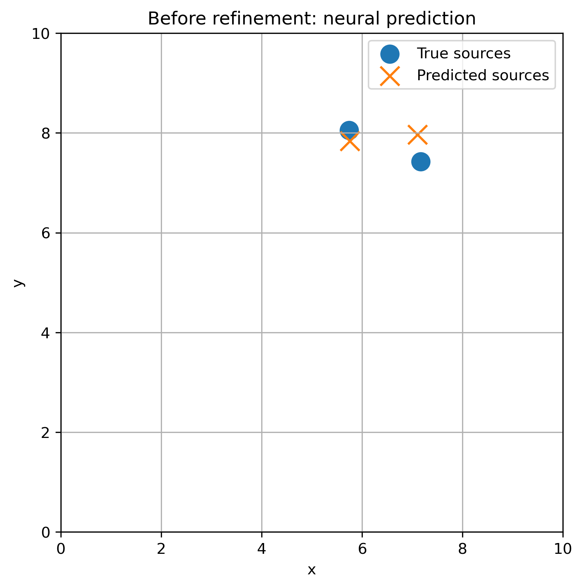
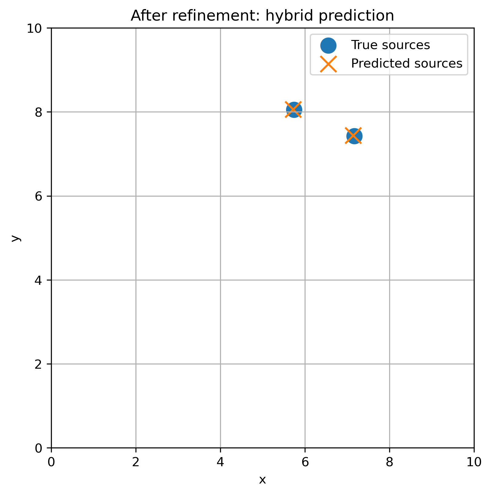

# Physics-Informed AI for Electrostatic Source Recovery

This project investigates a synthetic inverse electrostatics problem using neural networks and differentiable physics.

Given electric potential measurements on the boundary of a two-dimensional domain, the goal is to estimate the locations and charge magnitudes of hidden point sources inside the domain.

The project compares supervised learning, physics-informed learning, and a hybrid neural-physics refinement approach.

## Overview

Inverse problems are common in physics and engineering. In these problems, the objective is to infer unknown internal parameters from indirect or limited measurements.

In this project, the unknown parameters are the positions and magnitudes of two point charges. The available data consists only of electric potential measurements on the boundary of a square domain.

The project is designed as a university-level proof of concept. It demonstrates how a known physical forward model can be combined with neural networks to improve inverse parameter recovery.

## Problem Statement

The forward problem is to compute the electric potential generated by hidden softened point charges inside a 2D square domain.

The inverse problem is to recover the hidden source parameters from boundary potential measurements.

For each sample:

- Two source locations are randomly generated inside the domain
- Two charge values are randomly generated
- The electric potential is computed on a 2D grid
- Only the boundary values of the potential are used as input
- The model predicts the source positions and charge magnitudes

The predicted output has the form:

```text
(x1, y1, x2, y2, q1, q2)
```

where:

* `(x1, y1)` and `(x2, y2)` are the predicted source positions
* `q1` and `q2` are the predicted charge magnitudes

## Experimental Setup

| Parameter                |                         Value |
| ------------------------ | ----------------------------: |
| Domain                   | 2D square domain from 0 to 10 |
| Number of sources        |                             2 |
| Grid size                |                       50 × 50 |
| Boundary input dimension |                           196 |
| Output dimension         |                             6 |
| Training samples         |                         2,500 |
| Test samples             |                           500 |

## Methods

### 1. Differentiable Forward Model

A differentiable electrostatic forward model is used to compute the electric potential generated by softened point charges.

This model is used in two ways:

* To generate synthetic training and testing data
* To evaluate and refine predicted source parameters using physics-based optimization

### 2. Supervised Neural Inverse Solver

A multilayer perceptron, MLP, is trained to learn a direct inverse mapping:

```text
Boundary potential measurements → Source positions and charge magnitudes
```

The model receives boundary potential values as input and predicts the six unknown source parameters.

### 3. Physics-Informed Neural Training

The supervised model is further trained using a combined loss function:

```text
L_total = α L_supervised + β L_physics
```

The supervised loss compares the predicted source parameters with the true source parameters.

The physics loss uses the predicted source parameters to reconstruct the boundary potential through the differentiable forward model. The reconstructed boundary potential is then compared with the measured boundary potential.

This encourages the model to make predictions that are consistent with the underlying physical model.

### 4. Hybrid Neural + Physics Refinement

In the hybrid approach, the neural network prediction is used as an initial estimate. The predicted parameters are then refined using gradient-based optimization through the differentiable forward model.

This approach combines:

* The speed of neural network inference
* The accuracy improvement of physics-based optimization

## Results

The models are evaluated using two metrics:

* Mean position error
* Mean charge error

| Method                                 | Mean Position Error | Mean Charge Error |
| -------------------------------------- | ------------------: | ----------------: |
| Supervised MLP                         |               0.981 |             0.920 |
| Physics-informed MLP                   |               0.884 |             0.837 |
| Physics-informed MLP before refinement |               0.931 |             1.115 |
| Hybrid MLP + Physics Refinement        |           **0.516** |         **0.632** |

## Example Figures

The following plots compare the mean position and charge errors across the evaluated methods.





The following example illustrates how physics-based refinement improves the initial neural network prediction.

**Before refinement: neural prediction**



**After refinement: hybrid prediction**



## Discussion

The supervised MLP was able to learn an approximate inverse mapping from boundary measurements to source parameters.

Physics-informed training improved the average recovery accuracy compared with the purely supervised model.

The hybrid neural + physics refinement method achieved the best results in this experiment. This suggests that neural networks can provide useful initial guesses for inverse problems, while physics-based refinement can improve the final parameter estimates.

The results also show that using the known physical forward model can help reduce prediction errors, especially when the inverse problem is difficult or ill-conditioned.

## Repository Structure

```text
physics-informed-electrostatic-source-recovery/
├── notebooks/
│   └── 01_physics_informed_electrostatic_source_recovery.ipynb
├── src/
│   └── 01_physics_informed_electrostatic_source_recovery.py
├── requirements.txt
├── LICENSE
└── README.md
```

## How to Run

Clone the repository:

```bash
git clone https://github.com/s-sana-sharifi/physics-informed-electrostatic-source-recovery.git
cd physics-informed-electrostatic-source-recovery
```

Install the required dependencies:

```bash
pip install -r requirements.txt
```

Open the Jupyter notebook:

```bash
jupyter notebook notebooks/01_physics_informed_electrostatic_source_recovery.ipynb
```

Alternatively, the Python script can be run from the `src/` directory if the environment is configured correctly.

## Requirements

The main libraries used in this project are:

* Python 3.10+
* PyTorch
* NumPy
* Pandas
* Matplotlib
* Jupyter Notebook

## Skills and Concepts Demonstrated

This project demonstrates:

* Synthetic data generation
* Neural networks for inverse problems
* Physics-informed learning
* Differentiable physical modeling
* Gradient-based optimization
* Model evaluation and comparison
* Scientific visualization using Python

## Limitations

This project is a simplified synthetic experiment. It is not intended to model a real clinical, industrial, or experimental electrostatic system.

The main limitations are:

* The domain is two-dimensional
* The medium is assumed to be homogeneous
* The number of sources is fixed and known
* The sources are modeled as softened point charges
* Only synthetic data is used
* Noise and measurement uncertainty are not fully modeled

The purpose of the project is to demonstrate an inverse-modeling workflow rather than to solve a real-world source reconstruction problem directly.

## Future Work

Possible extensions of this project include:

* Testing different numbers of sources
* Testing more realistic noise models and measurement uncertainty
* Using sparse or partial boundary measurements
* Comparing against purely optimization-based inverse recovery
* Testing different neural network architectures
* Extending the problem to more realistic physical settings
* Applying a similar workflow to simplified dose reconstruction or detector-response problems

## License

This project is licensed under the MIT License. See the `LICENSE` file for more details.
